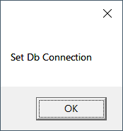
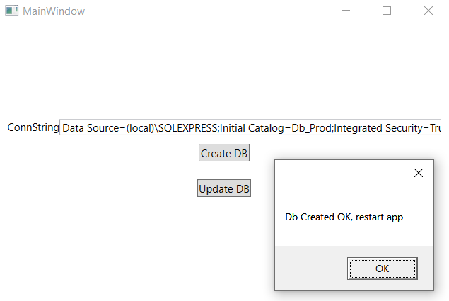

# Entity Framework: Semi-automatic Migrations
Your app alerts the user if the database has not being created yet or has changes, then they can create or update from runtime
1. Clone or download the code
   https://github.com/atorres16/EF-semi-automatic-migrations.git
2. To setup the environment for development, set the connection string in app.config
   ```xml
   <connectionStrings>
       <add name="Db" connectionString="Data Source=(local)\SQLEXPRESS;Initial Catalog=Dev_TestDB;Integrated Security=True;MultipleActiveResultSets=True" providerName="System.Data.SqlClient"/>
   </connectionStrings>
   ```
3. Add an initial migration
   ```
   add-migration init
   ```
4. Update the database. This will create a database only for development purposes
   ```
   update-database
   ```
5. Run the app and you'll get:
   
   
6. Set a connection string for production
   
   
7. Restart the app, you'll get:
    
   
8.  Click "Create Database":
         
11. Check your database, you'll see the end user database created
12. Modify the model, add a property to *Thing*
```csharp
    public class Thing
    {
        public int Id { get; set; }
        public string Property1 { get; set; }
    }
```
10. For your development environment, add a migration and update the database
    ```
    add-migration property1
    update-database
    ```
11. Run the app, you'll get:
    
    
12. Click "Update database":
    
    

                
       